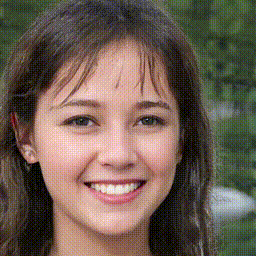
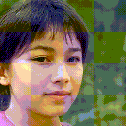

# alias-free-gan-pytorch

Unofficial implementation of Alias-Free Generative Adversarial Networks. (https://arxiv.org/abs/2106.12423) This implementation contains a lot of my guesses, so I think there are many differences to the official implementations

## Usage

First create lmdb datasets:

> python prepare_data.py --out LMDB_PATH --n_worker N_WORKER --size SIZE1,SIZE2,SIZE3,... DATASET_PATH

This will convert images to jpeg and pre-resizes it. This implementation does not use progressive growing, but you can create multiple resolution datasets using size arguments with comma separated lists, for the cases that you want to try another resolutions later.

Then you can train model in distributed settings

> python train.py  --n_gpu N_GPU --conf config/config-t.jsonnet training.batch=BATCH_SIZE path=LMDB_PATH

train.py supports Weights & Biases logging. If you want to use it, add `wandb=true` arguments to the script.

## Sample

